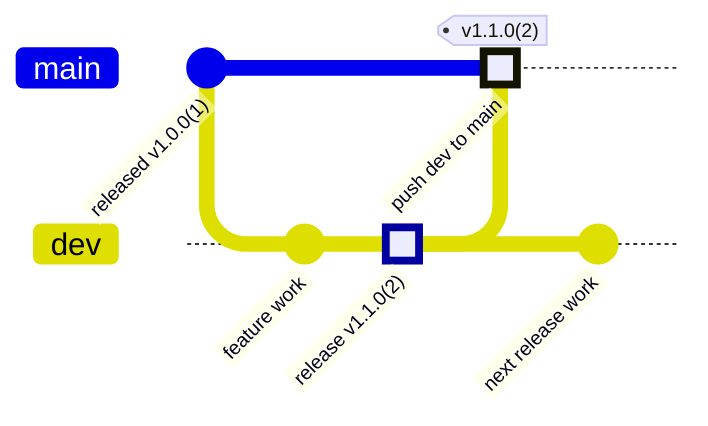

# __APP_NAME__

__APP_NAME__ は、__APP_DESCRIPTION__。

## 概要

- 対象ユーザー: __TARGET_USERS__
- 解決する課題: __PROBLEM_TO_SOLVE__
- 主な利用シーン: __PRIMARY_USE_CASES__
- 対応プラットフォーム: macOS __MIN_MACOS_VERSION__ 以降

## 主な機能

- __FEATURE_1__
- __FEATURE_2__
- __FEATURE_3__

## スクリーンショット

必要に応じて、アプリ画面や操作イメージを追加します。

```md

```

## 動作環境

- macOS __MIN_MACOS_VERSION__ 以降
- Xcode __XCODE_VERSION__ 以降
- Swift __SWIFT_VERSION__ 以降
- 追加ツール: __EXTRA_TOOLS__

## セットアップ

```sh
git clone __REPOSITORY_URL__
cd __REPOSITORY_NAME__
cp .env.example .env
```

`.env` の値はローカル環境に合わせて設定してください。署名・公証・配布に必要な値は `docs/release/README_local_DMG.md` を参照します。

## ビルドと実行

XcodeGen を使う場合:

```sh
xcodegen generate
open __APP_NAME__.xcodeproj
```

CLI から Release ビルドを行う場合:

```sh
xcodebuild \
  -scheme "__APP_NAME__" \
  -configuration Release \
  -destination "platform=macOS" \
  build
```

## テスト

```sh
xcodebuild \
  -scheme "__APP_NAME__" \
  -destination "platform=macOS" \
  test
```

テスト方針は `docs/rules/TestingStandards.md` を参照してください。

## プロジェクト構成

```text
__APP_NAME__/
  App/
  Core/
  Resources/
Tests/
Scripts/
docs/
```

- `__APP_NAME__/App`: アプリ起動、画面、アプリ固有の UI
- `__APP_NAME__/Core`: ドメインロジック、インフラ、共有ロジック
- `__APP_NAME__/Resources`: Asset catalog、Info.plist、entitlements、ローカライズ
- `Tests`: ユニットテスト、UI テスト
- `Scripts`: ビルド、リリース、補助スクリプト
- `docs`: 仕様、運用、規約

## ブランチ運用

このリポジトリでは `dev` を日常開発とリリース準備のブランチ、`main` を公開済みブランチとして扱います。`main` へ直接コミットせず、`dev` で検証済みのリリースを 1 つずつ `main` へ fast-forward します。



運用ルール:

- `main` と `dev` は長寿ブランチとして扱います。
- 日常開発とリリース準備は `dev` に積みます。
- `main` に存在しないリリースは `dev` 上で 1 つだけにします。
- `main` へ反映する前に branch policy を確認します。
- リリースタグは `v<MARKETING_VERSION>(<CURRENT_PROJECT_VERSION>)` 形式にします。

リリース前の確認:

```sh
git fetch origin --tags
BASE_REF=origin/main HEAD_REF=origin/dev ./Scripts/release/github/check_release_branch_policy.sh
```

`Release branch policy OK` が出たら、`dev` を push したうえで `main` へ反映します。

```sh
git push origin dev
git push origin dev:main
```

## バージョン管理

`project.yml` の次の値をリリースバージョンの正本にします。

- `MARKETING_VERSION`: ユーザー向けバージョン
- `CURRENT_PROJECT_VERSION`: build number

`CURRENT_PROJECT_VERSION` は `main` より大きい整数にしてください。

## リリース

DMG 作成と公証:

```sh
./Scripts/release/dmg/release_dmg.zsh --output-dir dist
```

生成物は既定で `dist/__APP_NAME__-<version>.dmg` に出力します。詳細は `docs/release/README_local_DMG.md` を参照してください。

GitHub Release:

- `dist/__APP_NAME__-<MARKETING_VERSION>.dmg` を `dev` に含めます。
- `dev` を `main` へ fast-forward push します。
- `.github/workflows/release.yml` が Git tag と GitHub Release を作成します。

テンプレート初期状態では workflow の release job は明示的に無効化されています。実プロジェクトで有効化する場合は、workflow 内の safety switch を確認してください。

itch.io 公開:

itch.io 公開は opt-in です。必要な場合だけ `docs/release/README_itch_io_optional.md` を参照してください。

## 設定

ローカル設定は `.env` に置きます。`.env` は Git 管理しません。

主な設定:

- `RELEASE_SCHEME`
- `RELEASE_OUTPUT_DIR`
- `CODESIGN_IDENTITY`
- `CODESIGN_ENTITLEMENTS`
- `NOTARY_APPLE_ID` / `NOTARY_TEAM_ID` / `NOTARY_APP_PASSWORD`
- `NOTARY_PROFILE`

## トラブルシューティング

### xcodegen が見つからない

```sh
brew install xcodegen
```

### create-dmg が見つからない

```sh
brew install create-dmg
```

### 公証に失敗する

- Developer ID Application 証明書がキーチェーンにあるか確認します。
- `.env` の `CODESIGN_IDENTITY` と `NOTARY_*` を確認します。
- `xcrun notarytool history` で credential の状態を確認します。

## ライセンス

__LICENSE_NAME__

詳細は `LICENSE` を参照してください。
